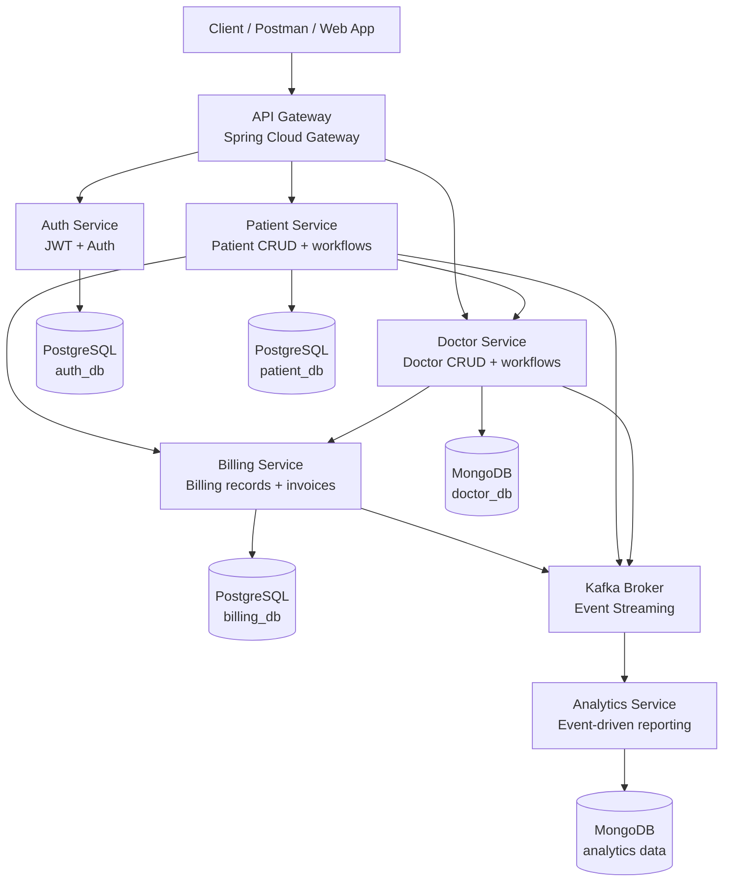
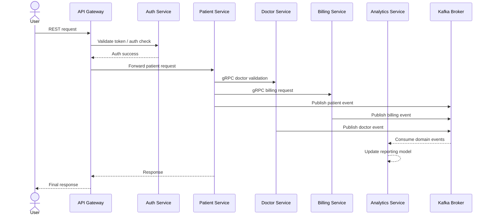
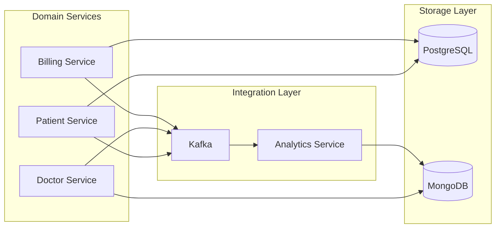

# 🏥 Healthcare Microservices Platform

This repository contains a distributed healthcare backend built with Spring Boot, gRPC, Kafka, PostgreSQL, MongoDB, and Docker. The services are organized around separate business domains and communicate through REST APIs, synchronous gRPC calls, and asynchronous Kafka events.

---

## 📖 Overview

The project demonstrates a realistic microservices setup for:

- authentication and authorization
- patient management
- doctor management
- billing operations
- analytics and event-driven reporting

The system is designed so each service can evolve independently while still cooperating through clear integration boundaries.

---

## API Testing

The complete Postman collection is available here:

📁 [Postman Collection](api-requests/postman_collection/SpBootGrpcProject.postman_collection.json)

Import the collection into Postman and update the JWT token variables after logging in.

## 🏗️ Architecture

The system is organized as a layered microservices architecture with a central gateway, domain services, event streaming, and separate data stores.

### High-level architecture



### Service interaction flow



### Data and messaging view



### How the services interact

- The API Gateway serves as the single entry point for all client requests.
- The Auth Service handles authentication and identity validation for protected routes.
- The Patient Service manages patient lifecycle operations and invokes downstream services over gRPC.
- The Doctor Service manages doctor-related domain operations and participates in cross-service validation flows.
- The Billing Service handles billing records and publishes domain events after business operations.
- The Analytics Service consumes Kafka events to maintain reporting and analytics data without direct coupling to the producing services.

---

## 🧩 Microservices

| Service | Primary responsibility | Data store | Communication style |
| --- | --- | --- | --- |
| API Gateway | Central entry point for incoming requests | None | REST routing |
| Auth Service | Authentication, authorization, and token validation | PostgreSQL | REST |
| Patient Service | Patient CRUD and patient lifecycle workflows | PostgreSQL | REST, gRPC, Kafka |
| Doctor Service | Doctor management and doctor-related workflows | MongoDB | REST, gRPC, Kafka |
| Billing Service | Billing generation and billing records | PostgreSQL | REST, gRPC, Kafka |
| Analytics Service | Consumes events and builds analytics/read models | MongoDB | Kafka |

---

## 🔄 Communication Patterns

### REST
Used for client-facing APIs and gateway routing.

### gRPC
Used for internal service-to-service calls such as:

- patient validation
- doctor validation
- billing creation

### Kafka
Used for asynchronous event propagation between services.

The Analytics Service listens to business events published by the other services so it can maintain reporting data without tight coupling.

---

## 🗂️ Project Structure

```text
patient-management/
├── api-gateway/
├── auth-service/
├── patient-service/
├── doctor-service/
├── billing-service/
├── analytics-service/
├── Integration-tests/
├── docker-compose.yml
└── Readme.md
```

---

## 🐳 Infrastructure and Runtime

The project uses Docker Compose to start the core infrastructure:

- PostgreSQL databases for auth, patient, and billing
- MongoDB for doctor and analytics data
- Kafka for event streaming
- All Spring Boot services as containerized apps

A typical startup flow is:

1. Start the infrastructure with Docker Compose.
2. Start the microservices.
3. Route requests through the API Gateway.
4. Let the services publish events to Kafka for analytics consumption.

---

## 🚀 Running the Project

From the repository root:

```bash
docker compose up --build
```

Then access the services through the gateway and service-specific ports defined in the Docker Compose setup.

Example entry points:

- API Gateway: http://localhost:8080
- Auth Service: http://localhost:8081
- Patient Service: http://localhost:4000
- Doctor Service: http://localhost:8082
- Billing Service: http://localhost:8083

---

## 🛠️ Technology Stack

- Java 21
- Spring Boot
- Spring Security
- Spring Cloud Gateway
- REST APIs
- gRPC
- Apache Kafka
- PostgreSQL
- MongoDB
- Docker / Docker Compose
- Maven

---

## � REST API Reference

The gateway exposes the public entry points, and the individual services expose their own REST endpoints underneath.

### Auth Service

Base path: /auth (through gateway) or / on the service itself

| Method | Endpoint | Description | Auth |
| --- | --- | --- | --- |
| POST | /auth/login | Authenticate a user and return a token | Public |
| GET | /auth/validate | Validate a bearer token | Required |
| POST | /auth/register | Register a new user account | Public |

### Internal Auth Management

| Method | Endpoint | Description | Auth |
| --- | --- | --- | --- |
| POST | /internal/users | Create an internal user | Internal |
| PUT | /internal/users/{id} | Update an internal user | Internal |
| DELETE | /internal/users/{id} | Delete an internal user | Internal |

### Patient Service

Base path: /api/patients (through gateway) or /patients on the service

| Method | Endpoint | Description | Auth |
| --- | --- | --- | --- |
| GET | /api/patients | Get all patients | ADMIN, STAFF, DOCTOR |
| POST | /api/patients | Create a patient | ADMIN, STAFF, DOCTOR |
| PUT | /api/patients/{id} | Update a patient | ADMIN, STAFF, DOCTOR |
| DELETE | /api/patients/delete/{id} | Delete a patient | ADMIN, STAFF, DOCTOR |
| GET | /api/patients/{id}/recommended-doctors | Get doctors recommended for a patient condition | ADMIN, STAFF, DOCTOR |
| GET | /api/patients/random | Fetch a random patient | ADMIN, STAFF, DOCTOR |
| GET | /api/patients/{patientId}/bills/{billId} | Retrieve a patient bill | ADMIN, PATIENT |
| PUT | /api/patients/{patientId}/bills/{billId}/pay | Pay a patient bill | ADMIN, PATIENT |

### Doctor Service

Base path: /api/doctors (through gateway) or /doctors on the service

| Method | Endpoint | Description | Auth |
| --- | --- | --- | --- |
| POST | /api/doctors | Create a doctor | ADMIN |
| GET | /api/doctors/{id} | Get a doctor by ID | Authenticated |
| GET | /api/doctors | Get all doctors | Authenticated |
| PUT | /api/doctors/{id} | Update a doctor | ADMIN |
| DELETE | /api/doctors/{id} | Delete a doctor | ADMIN |
| GET | /api/doctors/specialization/{specialization} | Get doctors by specialization | Authenticated |
| GET | /api/doctors/recommend | Recommend doctors by specialization | Authenticated |
| POST | /api/doctors/{doctorId}/prescriptions | Create a prescription for a doctor | Authenticated |
| GET | /api/doctors/prescriptions/{prescriptionId} | Get a prescription by ID | Authenticated |
| GET | /api/doctors/{doctorId}/prescriptions | Get prescriptions for a doctor | Authenticated |
| GET | /api/doctors/patients/{patientId}/prescriptions | Get prescriptions for a patient | Authenticated |
| DELETE | /api/doctors/prescriptions/{prescriptionId} | Delete a prescription | Authenticated |

---

## 🔧 gRPC API Reference

The services also communicate internally using gRPC contracts defined in the proto files.

### Billing Service gRPC

Service name: BillingService

| RPC | Request | Response | Purpose |
| --- | --- | --- | --- |
| GenerateBill | GenerateBillRequest | GenerateBillResponse | Create a billing record from prescription data |
| GetBill | GetBillRequest | BillResponse | Retrieve a bill by ID |
| PayBill | PayBillRequest | PaymentResponse | Mark a bill as paid |

#### Message shapes

- GenerateBillRequest: prescriptionId, patientId, doctorId, consultationFee, medicines[]
- GenerateBillResponse: billId, totalAmount, paymentStatus
- GetBillRequest: billId
- BillResponse: billId, prescriptionId, patientId, doctorId, consultationFee, medicineCost, totalAmount, paymentStatus
- PayBillRequest: billId
- PaymentResponse: billId, paymentStatus

### Doctor Service gRPC

Service name: DoctorServices

| RPC | Request | Response | Purpose |
| --- | --- | --- | --- |
| GetDoctorsBySpecialization | DoctorSpecializationRequest | DoctorListResponse | Return doctors matching a specialization |

#### Message shapes

- DoctorSpecializationRequest: specialization
- DoctorListResponse: doctors[]
- DoctorResponse: id, first_name, last_name, email, specialization, phone_number, qualification, experience

### Patient Service gRPC

Service name: PatientService

| RPC | Request | Response | Purpose |
| --- | --- | --- | --- |
| GetPatientById | GetPatientRequest | PatientResponse | Fetch a patient by ID |
| GetRandomPatient | Empty | PatientResponse | Return a random patient record |

#### Message shapes

- GetPatientRequest: patient_id
- PatientResponse: id, name, email, address, date_of_birth

---

## �🎯 What this project demonstrates

This repository is a good example of:

- service decomposition
- inter-service communication
- event-driven architecture
- polyglot persistence
- container-based deployment
- distributed backend design

---

## 🤝 Notes

The current implementation uses an API Gateway, authentication service, patient/doctor/billing services, and an analytics service. The repository also contains an Integration-tests module for end-to-end verification.
